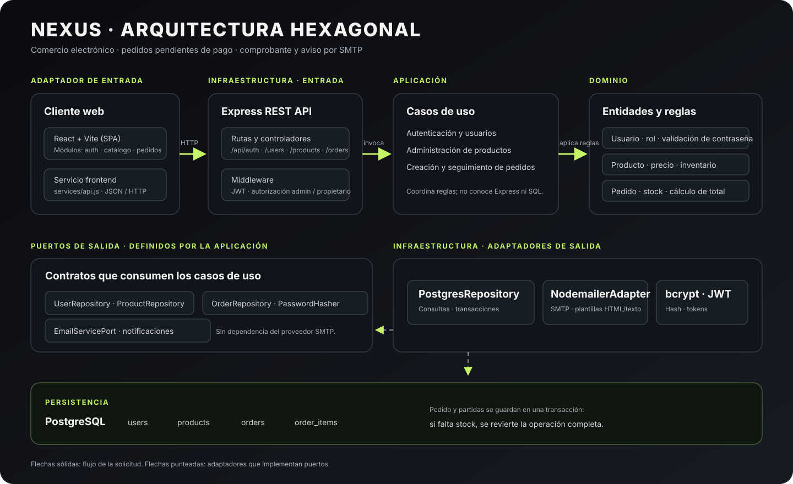

# Arquitectura de NEXUS PC Gaming

El sistema separa la tienda web del servidor REST. React consume la API por HTTP/JSON; el servidor Express traduce esas solicitudes a casos de uso. La lógica de negocio no depende de Express ni de PostgreSQL: se comunica mediante puertos que implementan los adaptadores de infraestructura.

## Capas y responsabilidades

| Capa | Responsabilidad | Ubicación en el repositorio |
|---|---|---|
| Frontend | SPA para autenticación, catálogo, carrito y pedidos; encapsula llamadas HTTP. | `frontend/src/` |
| Adaptador de entrada | Rutas REST, controladores, autenticación JWT, autorización por rol y validación de acceso. | `backend/src/infrastructure/adapters/inbound/http/` |
| Aplicación | Casos de uso de autenticación, usuarios, productos y pedidos; coordina operaciones mediante puertos. | `backend/src/application/use-cases/` |
| Dominio | Entidades y reglas de usuarios, contraseñas, productos, stock, pedidos y totales. | `backend/src/domain/` |
| Puertos | Contratos que necesita la aplicación: repositorios, hash y servicio de correo. | `backend/src/application/ports/` |
| Adaptadores de salida | Implementación de PostgreSQL, Nodemailer/SMTP, bcrypt y JWT. | `backend/src/infrastructure/adapters/outbound/` y `security/` |
| Persistencia | Tablas y restricciones relacionales de PostgreSQL. | `backend/database/schema.sql` |

## Dirección de dependencias

Los controladores dependen de los casos de uso; estos dependen de reglas del dominio y contratos (puertos). Los adaptadores implementan los contratos. PostgreSQL persiste usuarios, productos, pedidos y partidas. bcrypt genera y verifica hashes de contraseñas (no se guardan contraseñas en texto plano); JWT identifica al usuario autenticado y su rol.

Al crear un pedido, la aplicación verifica existencias y el adaptador PostgreSQL descuenta inventario, crea pedido y partidas y calcula/guarda importes en una transacción. El estado inicial es `pending` (presentado al usuario como **Pendiente de Pago**). Después del commit, el caso de uso invoca el puerto `EmailServicePort`: envía el comprobante e instrucciones al cliente y, si `ADMIN_EMAIL` está configurado, avisa al administrador. El puerto no conoce Nodemailer; `NodemailerAdapter` implementa el contrato usando el SMTP configurado. Un fallo de correo se informa en `email_notifications` y no revierte el pedido persistido. La relación pedido-producto se materializa mediante `order_items`.

Las plantillas de cliente y administrador están en `backend/src/infrastructure/adapters/outbound/emailTemplates.js`; escapan contenido dinámico antes de generar HTML. Las instrucciones de pago se configuran mediante `PAYMENT_INSTRUCTIONS`. En entornos de prueba se debe usar texto ficticio, nunca datos bancarios reales.

## Seguridad y reglas relevantes

- Rutas privadas requieren `Authorization: Bearer <token>`; las de administración verifican rol `admin`.
- La contraseña se valida en el dominio y se almacena como hash bcrypt; nunca debe devolverse en respuestas.
- Un cliente sólo consulta sus usuarios/pedidos; administración puede consultar los recursos globales permitidos.
- Eliminar un usuario con pedidos o un producto ligado a pedidos es restringido por las relaciones de PostgreSQL.
- Cancelar un pedido pendiente repone inventario; cancelar no equivale a borrar el registro de auditoría.
- El cliente web aísla las solicitudes en `frontend/src/services/api.js`.
- Las credenciales SMTP viven sólo en `.env` local o en un gestor de secretos, nunca en Git. Sin SMTP configurado, el pedido sigue guardándose y la API reporta el envío como fallido.

## Prueba de correo

`cd backend && npm test` prueba el caso de uso con un puerto simulado. `npm run test:email` crea una cuenta Ethereal y envía dos mensajes con datos ficticios; imprime URLs de vista previa para revisar y capturar evidencia. No usa pedidos ni destinatarios reales.

Para la lista de operaciones y permisos, consultar [Especificación de endpoints](endpoints.md). Para arrancar la aplicación, consultar [Guía de WSL](despliegue-wsl.md).
